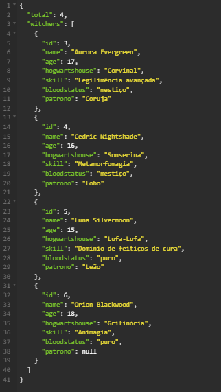
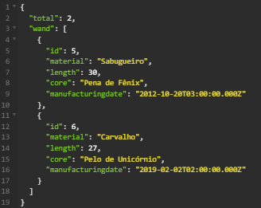

# Backend Harry Potter 

Este projeto é uma aplicação backend desenvolvida em Node.js, com o objetivo de gerenciar informações sobre bruxos e varinhas do universo de Harry Potter. Utilizando o framework Express.js, o projeto define rotas para manipular dados de bruxos e varinhas, armazenados em um banco de dados.

## Bruxos

## Varinhas

